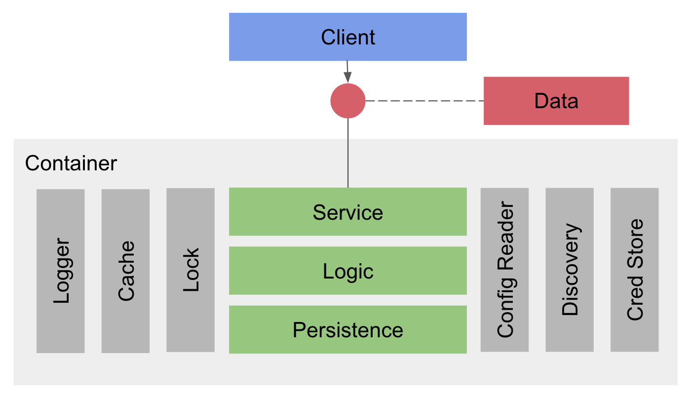
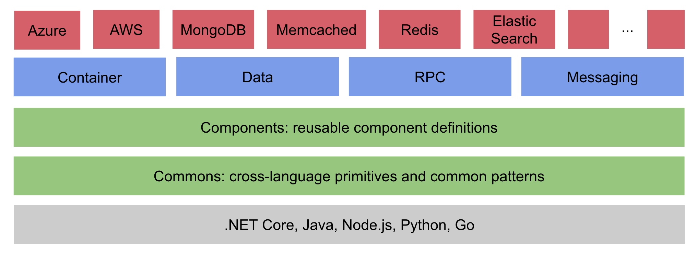

#    cross-language and cross-platform microservices toolkit

Pip.Services is a unique microservices toolkit that allows you to develop microservices
in different languages using symmetric structure and patterns, make them interoperable with each other
and run on variety of different platforms.

With Pip.Services you can:
- Speedup your microservice development by using prebuilt patterns and components
- Use the toolkit by itself or easily mixed with other frameworks
- Confidently high-quality production-grade microservices
- Develop interoperable microservices in .NET, Java, Node.js, Python, and Go (under development)
- Run microservices on AWS, Azure, Go Cloud or on premises
- Deploy microservices in Docker, Serverless, Service Fabric or in other containers.
- Switching platforms and technologies without touching existing code

<!--
To unleash that potential, microservices developed using Pip.Services toolkit often employ componentized design:

  

-->

## Architecture

Pip.Services toolkit is divided into several modules:

  

Version 3.0 which is released in September 2018 offers cleaner implementation and fine granular 
module breakdown to optimize external dependencies.

- **Commons**: cross-language primitives and common implementation patterns
   
  [.NET](http://github.com/pip-services-dotnet/pip-services-commons-dotnet) | 
  [Java](http://github.com/pip-services-java/pip-services-commons-java) | 
  [Node.js](http://github.com/pip-services-node/pip-services-commons-node) | 
  [Python](http://github.com/pip-services-python/pip-services-commons-python) | 
  [Go](http://github.com/pip-services-go/pip-services-commons-go)
- **Components**: generic component definitions
- **Container**: inversion of control (IoC) container
- **Data**: data processing interfaces and abstract persistence components
- **RPC**: components to implement synchronous communication (remote procedure calls or RPC)
- **Messaging**: components to implement asynchronous communication (async messaging)

On the top of that core, the toolkit has a number of technology-specific modules:
- **AWS**: AWS specific components
- **Azure**: Azure specific components
- **MongoDB**: MongoDB persistence components
- **Memcached**: Memcached caching and synchronization components
- **Redis**: Redis caching and synchronization components
- **Prometheus**: Components for performance monitoring with Prometheus
- **MQTT**: MQTT messaging components
- **RabbitMQ**: RabbitMQ messaging components
- **ElasticSearch**: ElasticSearch logging

And more components and modules are added every month!

The unique features of Pip.Services toolkit made possible to develop a rich library of reusable microservice
that can be tailored to your technological platform by using simple configuration.
To learn more about the library please visit [http://github.com/pip-services/pip-services-library](http://github.com/pip-services/pip-services-library).

## Quick Links

- [Pip.Services discussion forum](https://groups.google.com/forum/#!forum/pip-services)

## Acknowledgements

This project would not be possible without effort contributed by particular individuals.

- **Sergey Seroukhov** - the project founder
- **Mark Zontak** - Node.js and .NET implementations, AWS integration
- **Volodymyr Tkachenko** - .NET implementation, Service Fabric and Docker deployments
- **Alex Mazur** - .NET implementations, Azure integration
- **Andrew Harrinton** - .NET implementation, ElasticSearch, Prometheus and other technology-specific modules
- **Alex Masliev** - Website and graphics

We also would like to recognize help received from the following companies.

- **Digital Living Software Corp.**
- [**Modular Mining Systems Inc.**](http://www.mmsi.com)
- [**BootBarn**](http://www.bootbarn.com)
- [**EPAM**](http://www.epam.com)
- [**Kyrio**](http://www.kyrio.com)
